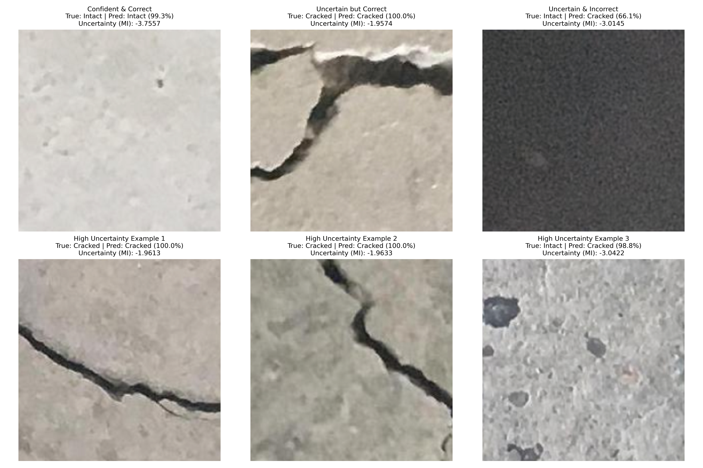

# 📸 Probabilistic Crack Detection with MC Dropout

[](https://www.python.org/)
[](https://pytorch.org/)
[](https://opensource.org/licenses/MIT)

> A deep learning model that not only classifies concrete images as 'Cracked' or 'Intact' but also quantifies its own uncertainty—a critical step towards building reliable, safety-aware AI systems for structural inspection.

---

## 📌 Overview

This project implements a modern approach to automated visual inspection using a probabilistic deep learning model. The classifier is built on a **ResNet18** architecture and leverages **transfer learning** for high performance and rapid training.

Crucially, it uses **Monte Carlo (MC) Dropout** to approximate Bayesian inference. This allows the model to produce an uncertainty score with each prediction, enabling it to "know what it doesn't know" when faced with ambiguous or novel images.

---

## ✅ Key Features

-   **🎯 High Accuracy:** Achieves >99% classification accuracy on the validation set through transfer learning.
-   **🤔 Uncertainty Quantification:** Uses MC Dropout to identify ambiguous images, which is critical for real-world deployment where reliability is paramount.
-   **🚀 Modern Technique:** Employs a widely-adopted method for uncertainty estimation that is compatible with the latest deep learning frameworks.
-   **⏱️ Efficient Training:** The entire training and evaluation process can be completed in under an hour on a standard GPU.

---

## 📈 Results & Uncertainty Visualization

The key output of this model is its ability to distinguish between confident predictions and uncertain ones. The model correctly identifies that it is uncertain when faced with ambiguous images (e.g., poor lighting, unusual textures), effectively flagging them for human review.



---

## 🛠️ Getting Started

### Prerequisites

Ensure you have a Python environment with the following packages installed.

```bash
# Install required packages
pip install torch torchvision scikit-learn matplotlib tqdm scipy
